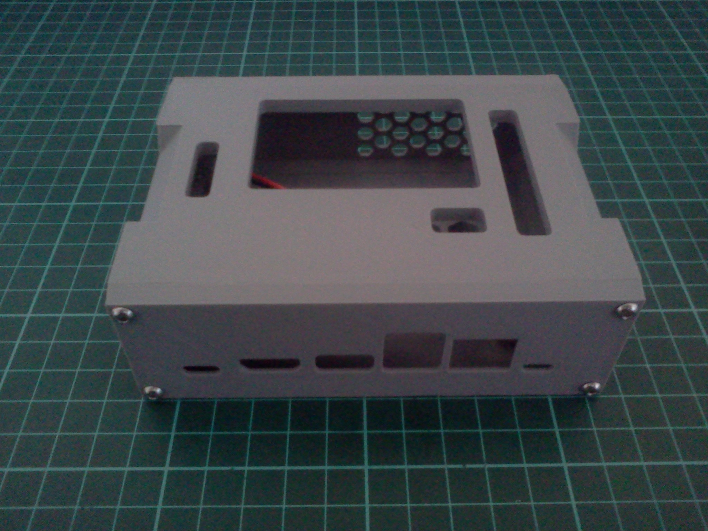
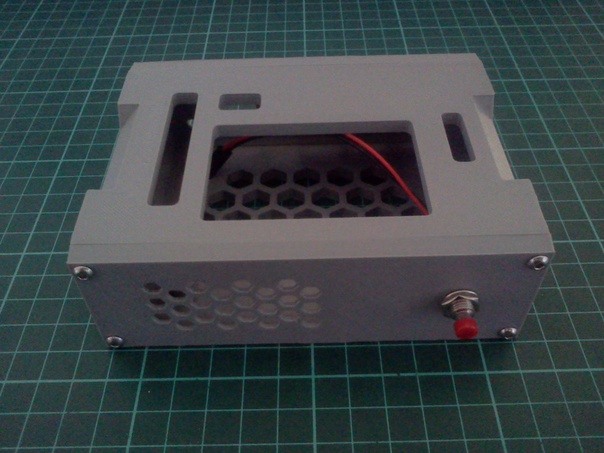
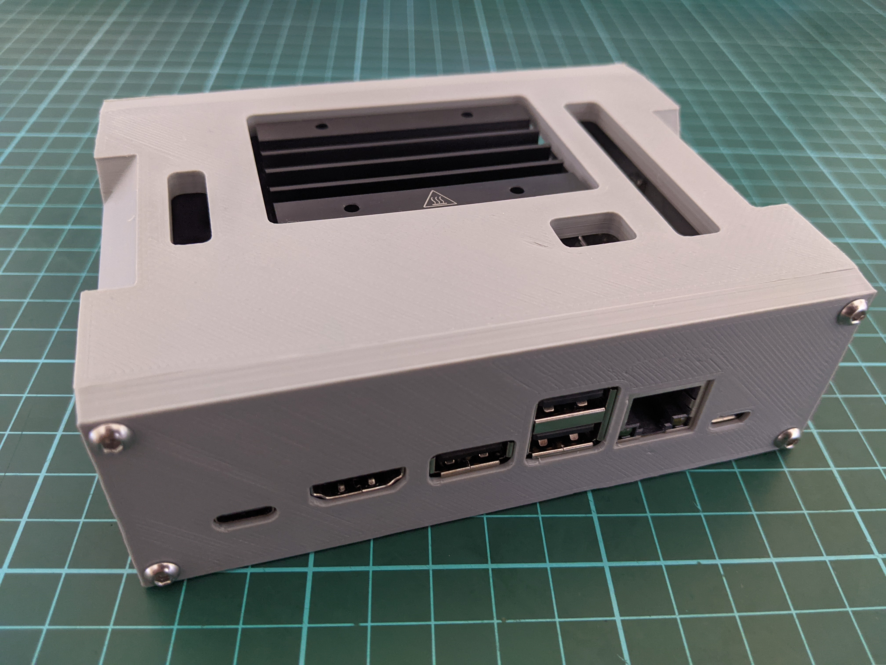

# Jetson Nano 2GB Case

<table>
    <tr>
        <td>
            <b>Inventor (2022)</b>
        </td>
    </tr>
    <tr>
        <td>
            
        </td>
    </tr>
</table>

<table>
   </tr>
        <tr>
        <td>
            <b>Front</b>
        </td>
        <td>
            <b>Rear</b>
        </td>
    </tr>
    <tr>
        <td>
            
        </td>
        <td>
            
        </td>
    </tr>
</table>

<table>
   </tr>
    <tr>
        <td>
            <b>Assembly</b>
        </td>
    </tr>
    <tr>
        <td>
            
        </td>
    </tr>
</table>
  
## About

## Printing

| Parameter       | Value       |
| --------------- | ----------- |
| Material Type   | PLA         |
| Material Weight | 100g        |
| Layer Height    | 0.2mm       |
| Printing Time   | 12.00 Hours |
| Printer Model   | Ender3 V2   |

**_Note: there are a total of 4 parts to print, and there is some post-processing involved in adding
the brass insert nuts_**

## Improvements

-   Add some mounting options to the bottom of the enclosure which will allow it to be easily
    included as a sub-assembly in another project.
